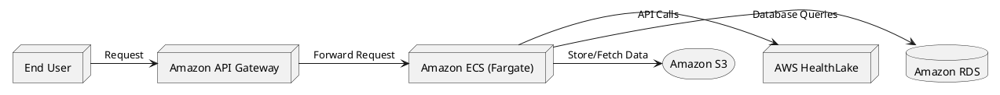

# Arquitectura de infraestructura y gobierno de tics - 2024-2

Sitio: https://sites.google.com/unal.edu.co/infra-arch-and-tic-gov/

- Fecha límite: 27-11-24 5:59pm
    - Asunto: [Infra & Arch] Tarea 01
- Contenido caso oauth 2.0 correo UNAL
    - Modelo BPMN svg/png
    - Modelo C4 (contexto, contenedores, componentes) svg/png

